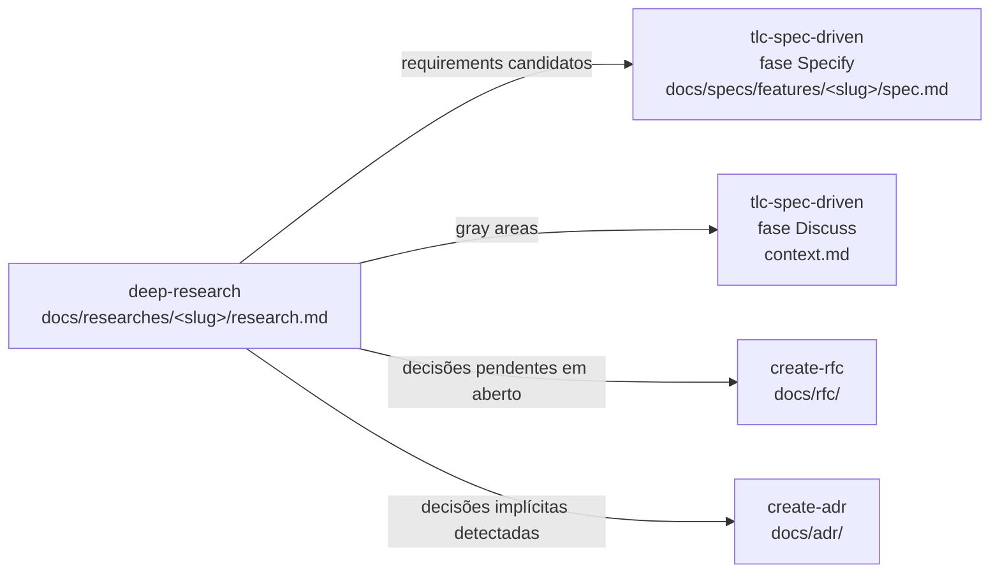

# Handoff — como o research vira insumo do `tlc-spec-driven`

> Esta referência explica **como o `research.md` é consumido** pela skill `tlc-spec-driven` na fase Specify. Use isto para estruturar a seção `7. Handoff TLC Spec-Driven` do research e garantir que a próxima skill encontre tudo que precisa, sem retrabalho.

## Fluxo esperado



**Convenção crítica**: o slug do research **deve ser o mesmo** da feature que ele vai alimentar. Se a pesquisa é `docs/researches/cap-clean-arch/`, a feature subsequente será `docs/specs/features/cap-clean-arch/`.

## O que a Specify precisa do research

A skill `tlc-spec-driven` (fase Specify) usa o `research.md` para:

1. **Problem Statement** — extraído da seção `Cabeçalho > Resumo` + Seção 4 (Gaps).
2. **Out of Scope** — derivado das hipóteses descartadas (Seção 5) e dos gaps que não cabem no MVP (Seção 4).
3. **User Stories (P1/P2/P3)** — vêm diretamente da Seção 7.1 (Requirements candidatos) do handoff.
4. **Acceptance Criteria** — referenciam achados específicos (Seção 2) para WHEN/THEN testáveis.
5. **Decision Log inicial** — herda hipóteses confirmadas pelo usuário durante a Specify; ADRs já registrados ficam linkados, não duplicados.
6. **Discuss (gray areas)** — lista exata da Seção 7.2 do handoff.

Por isso, **quanto mais estruturada estiver a Seção 7**, menos retrabalho a Specify exige.

## Template da Seção 7 (handoff)

Esta é a seção que vai dentro do `research.md`. Use como guia ao fechar o documento.

````markdown
## 7. Handoff TLC Spec-Driven

**Próximo passo sugerido**: invocar a skill `tlc-spec-driven` → fase **Specify** carregando este `research.md` como contexto base.

**Slug da feature**: `<slug>` (deve casar com o slug deste research).

### 7.1 Requirements candidatos

> Lista de user stories que esta pesquisa sugere para a fase Specify avaliar. Cada item vem com prioridade tentativa e suporte em achados específicos.

| ID provisório | Prioridade | User story (1 linha) | Suporte no research |
|---|---|---|---|
| REQ-01 | P1 ⭐ MVP | Como dev Numen DS, quero scaffold de projeto CAP via STDIO local | Seção 2.1 (E1), Seção 1 |
| REQ-02 | P1 ⭐ MVP | Como dev, quero o linter pinado conforme `numen-mro/backend/.../eslint.config.mjs` | Seção 2.3 (Lint), prompt verbatim |
| REQ-03 | P2 | Como dev, quero alias de import `@/` resolvendo `src/` | Seção 2.4 |
| REQ-04 | P3 | Como time, queremos publicação npm com chave privada (Future Consideration) | Seção 5 (H4) |

**Notas**:
- IDs são provisórios; a Specify renumera no padrão da feature.
- Prioridade é hipótese — Specify confirma/realoca após o discuss.
- "Suporte" cita seção do research que justifica a inclusão.

### 7.2 Gray areas para o discuss

> Pontos que **a Specify precisa discutir com o usuário** antes de cravar o requirement. Não decida aqui.

| # | Tema | Pergunta aberta | Suporte |
|---|---|---|---|
| GA-01 | Naming do pacote | `cap-clean-arch/` ou `mcp-cap-clean-arch/`? | Seção 1, hipótese H2 |
| GA-02 | Versão do MCP SDK | GA (1.11.x) ou alfa (2.0.0-alpha)? | Seção 6.4 (releases) |
| GA-03 | Localização dos testes | Co-localizados (`src/**/*.spec.ts`) ou separados (`test/unit/`)? | Briefing verbatim do usuário |

### 7.3 Decisões que merecem ADR/RFC separado

> Pontos descobertos pela pesquisa que **não cabem como requirement** e devem virar documento de decisão **antes** ou **em paralelo** à Specify.

#### ADRs candidatos (decisões já tomadas implicitamente — registrar retroativamente)

- **ADR-NNN — Transporte STDIO sem auth nos novos MCPs**: já implementado em `mcp-react-clean-arch`. Registrar via skill `create-adr` antes da Specify para a feature consumir.
- **ADR-NNN — Skip silencioso de arquivos existentes**: confirmado em `tool-executor.ts:18`. Idem.

#### RFCs candidatos (decisões em aberto com 2+ opções equivalentes)

- **RFC-NNN — Estratégia de publicação dos MCPs**: 3 opções (sem publicação, npm privado, GitHub Packages). Gerar via skill `create-rfc`.

### 7.4 Bibliografia mínima que a Specify deve carregar

A fase Specify deve ler (além do template padrão de `spec.md`):

- ⭐ `docs/researches/<slug>/research.md` (este documento).
- `docs/researches/<slug>/prompts/<slug>.md` (briefing verbatim — restrições e intenções literais do usuário).
- `<path-do-codebase-modelo-mais-relevante>` (referência central do padrão).
- `docs/specs/project/PROJECT.md` (vision e constraints globais).
- `docs/specs/project/STATE.md` (decisões persistentes que podem impactar a feature).

### 7.5 O que esta pesquisa **não** decidiu

> Reforço explícito do princípio "pesquisa não é decisão":

- ❌ Não escolhemos entre <opção A> e <opção B> — fica para a Specify ou RFC.
- ❌ Não definimos versão exata de <lib> — fica para o design.
- ❌ Não validamos performance ou edge cases — exige spike na fase Execute.
- ❌ Não validamos UX/UI (se aplicável) — fica para mockups/discuss.

### 7.6 Sinais de que a Specify deve voltar para a pesquisa

Se durante a Specify aparecerem os sinais abaixo, vale **abrir uma nova rodada** com `deep-research` (ou complementar a transcrição existente):

- Surgiu uma dimensão totalmente nova não mapeada (ex.: requirement não-funcional de segurança nunca discutido).
- Detectada contradição entre dois achados do research.
- Usuário pediu para considerar uma fonte/tecnologia/repositório ainda não consultado.
- Mais de 30% dos requirements candidatos foram descartados — sinal de que o escopo estava mal calibrado.

Nestes casos, voltar à Fase 1 da `deep-research` com escopo afinado.
````

## Convenções de slug

Para garantir que research, feature, review e ADR/RFC se conectem:

| Etapa | Path | Slug esperado |
|---|---|---|
| Pesquisa | `docs/researches/<slug>/research.md` | `<slug>` |
| Spec | `docs/specs/features/<slug>/spec.md` | `<slug>` mesmo |
| Design | `docs/specs/features/<slug>/design.md` | `<slug>` mesmo |
| Tasks | `docs/specs/features/<slug>/tasks.md` | `<slug>` mesmo |
| Review | `.review-results/<slug>/SUMMARY.md` | `<slug>` mesmo |
| ADR derivado | `docs/adr/NNN-<slug-curto>.md` | `<slug>` ou derivação |
| RFC derivado | `docs/rfc/NNN-<slug-curto>.md` | `<slug>` ou derivação |

**Regra**: o `<slug>` é a "chave estrangeira" do fluxo agêntico. Manter consistente facilita auditoria, busca e cross-references.

## Anti-padrões no handoff

- ❌ **Empurrar decisão para a Specify sem alternativas**: liste sempre opções, mesmo que enxuto.
- ❌ **Inflar requirements candidatos**: se um item não tem suporte claro em achados, não vai para 7.1 — vai para 7.5 como "não decidido".
- ❌ **Misturar requirement com gray area**: requirement já está claro o suficiente para WHEN/THEN; gray area precisa de discussão antes.
- ❌ **Omitir bibliografia mínima**: a próxima skill perde tempo redescobrindo arquivos. Liste-os.
- ❌ **Handoff sem slug**: sempre nomear explicitamente o slug esperado da feature.
