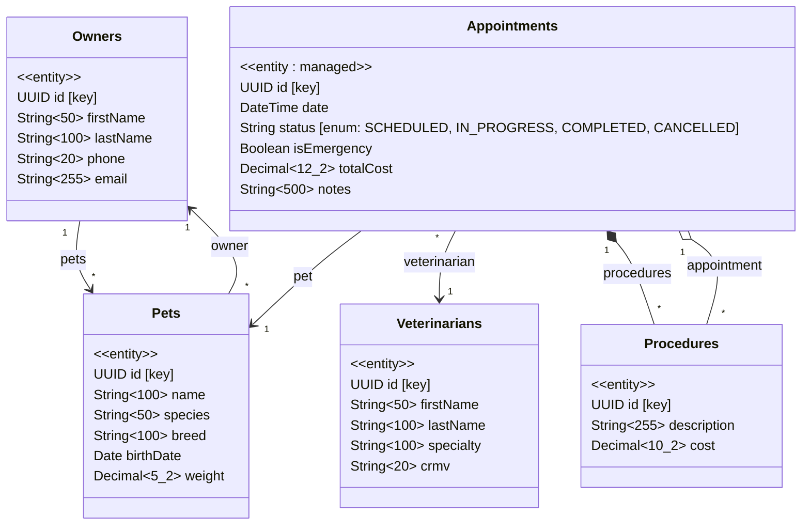

# Desafio Trainee CAP 2026 - VetCare Clinic

## Contexto do Desafio

A **VetCare Clinic** é uma rede de clínicas veterinárias em expansão que atende milhares de pets por mês. Atualmente, todo o controle de agendamentos, cadastro de animais e gestão dos veterinários é feito em planilhas. Com o crescimento, isso se tornou insustentável: agendamentos duplicados, perda de histórico de procedimentos e dificuldade em gerar relatórios financeiros por tutor.

Você foi contratado como desenvolvedor para construir o **backend do sistema de gestão da clínica**. O sistema precisa gerenciar tutores (donos dos pets), seus animais, os veterinários da clínica, os agendamentos de consultas e os procedimentos realizados em cada consulta.

A clínica também precisa de funcionalidades específicas:
- **Agendar consultas de emergência** com cobrança de taxa adicional
- **Consultar a agenda de um veterinário** por período
- **Gerar relatório de gastos por tutor** com base nas consultas finalizadas

---

## Objetivo

Desenvolver um serviço backend completo utilizando **SAP CAP com TypeScript**, seguindo a arquitetura **Clean Architecture com 5 camadas** (Presentation, Domain, Data, Infra, Main). O projeto deve demonstrar domínio em:

- Modelagem de dados com CDS (entidades, associações, composições)
- Implementação de Actions e Functions personalizadas
- Event handlers (before/after em operações de entidades)
- Tratamento de erros funcional com a lib **Either** (`@sweet-monads/either`)
- Separação de responsabilidades seguindo o padrão Clean Architecture
- Testes HTTP para validação dos endpoints

> **Importante:** Este desafio NÃO é sobre copiar código. É sobre entender a arquitetura, consultar referências e aplicar os conceitos na prática. Se tiver dúvidas sobre a estrutura ou o papel de cada camada, consulte o arquivo `CLEAN-ARCHITECTURE-CAP.md` disponível no repositório.

---

## Pré-requisitos

- Node.js (versão 20 || 22)
- Yarn instalado globalmente
- SAP CAP (`@sap/cds-dk`) instalado globalmente
- Git configurado
- REST Client (extensão do VS Code) ou ferramenta equivalente para testar endpoints HTTP

---

## Configuração Inicial

### 1. Clonar o repositório template

Clonar o repositório que contém a estrutura base do projeto:

```
https://github.com/ThaliagB2/challenge-cap-trainee
```

### 2. Criar a branch de trabalho

A partir da branch `main`, criar sua branch de trabalho seguindo o padrão:

```
feature/seunome-trainee-2026
```

**Exemplo:** `feature/maria-trainee-2026`

Todos os commits devem ser feitos nesta branch.

### 3. Instalar dependências e executar o setup

Na **pasta raiz** do projeto clonado, executar:

1. **`yarn`** — Instala as dependências do projeto raiz
2. **`yarn setup`** — Executa o script interativo de configuração do template

O script de setup irá solicitar duas informações:

| Pergunta | O que informar | Exemplo |
|----------|---------------|---------|
| **App name** | Nome do seu serviço (em kebab-case) | `vet-clinic-service` |
| **Schema name** | Nome do schema do banco de dados (em UPPER_SNAKE_CASE) | `VET_CLINIC_SCHEMA` |

O script irá automaticamente:
- Substituir os placeholders `{{app-name}}`, `{{app-name-without-dash}}`, `{{UpperCamelCaseAppName}}` e `{{schema-name}}` em todos os arquivos de configuração
- Renomear a pasta `sample-service/` para o nome do app escolhido (ex: `vet-clinic-service/`)
- Remover o próprio script de setup após a execução

### 4. Instalar dependências do serviço

Após o setup, entrar na pasta do serviço (que agora tem o nome que você escolheu) e instalar as dependências:

1. Entrar na pasta do serviço (ex: `vet-clinic-service/`)
2. Executar **`yarn`** para instalar as dependências do serviço

### 5. Verificar que o projeto inicia corretamente

Executar o comando de desenvolvimento para garantir que tudo está funcionando:

- **`yarn dev`** — Este comando irá:
  1. Construir o banco de dados local (SQLite)
  2. Gerar os tipos TypeScript a partir dos modelos CDS
  3. Iniciar o servidor CAP com hot-reload

Se o servidor subir sem erros, a configuração está concluída.

> **Nota:** O projeto template já contém exemplos funcionais (Products, PurchaseOrders). Estude esses exemplos para entender os padrões antes de começar a implementar. Eles servem como referência de como cada camada funciona.

---

## Regras de Versionamento

### Conventional Commits

Todos os commits devem seguir o padrão **Conventional Commits** em **inglês**:

```
<type>: <description>
```

**Tipos permitidos:**

| Tipo | Quando usar |
|------|-------------|
| `feat` | Nova funcionalidade |
| `fix` | Correção de bug |
| `refactor` | Refatoração sem mudar comportamento |
| `chore` | Tarefas de configuração, setup, dependências |
| `test` | Adição ou alteração de testes |
| `docs` | Documentação |

**Exemplos de commits válidos:**
- `feat: add veterinary clinic CDS entity definitions`
- `feat: add domain models for pets and owners`
- `feat: implement owner expense report function`
- `fix: handle not found error in appointment creation`
- `chore: add CSV seed data for initial database population`
- `test: add HTTP tests for appointment endpoints`

**Referência completa:** [Conventional Commits v1.0.0-beta.4](https://www.conventionalcommits.org/pt-br/v1.0.0-beta.4/)

> Faça commits frequentes e atômicos. Cada commit deve representar uma unidade lógica de trabalho completa.

---

## Diagrama UML das Entidades

O sistema possui **5 entidades** com associações e composições. O diagrama abaixo define a estrutura, os tipos e os relacionamentos. Sua tarefa é transformar este diagrama em definições CDS.




### Legenda dos Relacionamentos

| Símbolo | Tipo | Significado |
|---------|------|-------------|
| `-->` | **Association** | Relacionamento simples entre entidades independentes |
| `*--` | **Composition** | Relacionamento pai-filho (Procedures só existem dentro de um Appointment) |
| `managed` | **Aspecto CDS** | Adiciona automaticamente campos de auditoria (createdAt, createdBy, modifiedAt, modifiedBy) |

> **Observação:** O diagrama UML acima contém caracteres especiais que podem não renderizar corretamente em todos os editores. Certifique-se de que você está vendo o diagrama completo antes de começar. Acesse o Mermaid Open Source para visualizar corretamente: https://mermaid.live/

### Observações sobre as Entidades

- **Owners** possui uma associação reversa para acessar todos os seus Pets
- **Pets** pertence a um Owner (associação obrigatória)
- **Appointments** utiliza o aspecto `managed` do CDS para auditoria automática
- **Appointments** possui um campo `status` do tipo enum com 4 valores possíveis
- **Procedures** é uma composição de Appointments — ao deletar um agendamento, seus procedimentos são deletados juntos
- Os tipos e tamanhos dos campos estão definidos no diagrama — respeite-os na implementação CDS

---

## Etapas do Desafio

### Etapa 1 — Configuração e Estrutura Inicial

**Objetivo:** Preparar o ambiente e entender a arquitetura do projeto.

**Tasks:**

- [x] Clonar o repositório template
- [x] Criar a branch `feature/seunome-trainee-2026` a partir da `main`
- [x] Executar `yarn` e `yarn setup` na raiz do projeto
- [x] Instalar dependências do serviço e verificar que o projeto inicia com `yarn dev`
- [x] Estudar a estrutura do projeto template e os exemplos existentes (Products, PurchaseOrders)
- [x] Ler o arquivo `CLEAN-ARCHITECTURE-CAP.md` por completo para entender cada camada

**Sugestão de commit:** `chore: initial project setup and configuration`

---

### Etapa 2 — Camada de Banco de Dados (`db/`)

**Objetivo:** Criar as entidades CDS e os dados iniciais.

**Tasks:**

- [x] Criar os arquivos CDS para as 5 entidades na pasta `db/models/`, seguindo o diagrama UML
- [x] Definir as associações (Association) e composições (Composition) corretamente
- [x] Utilizar o aspecto `managed` na entidade Appointments
- [x] Implementar o campo `status` como enum com os 4 valores definidos
- [x] Criar o arquivo barrel (`index.cds`) importando todos os modelos
- [x] Criar os tipos CDS em `db/types/` para os payloads e retornos da Action e das Functions
- [x] Criar os arquivos CSV na pasta `test/data/` para popular o banco com dados iniciais:
  - CSV para Owners (mínimo 5 registros)
  - CSV para Pets (mínimo 8 registros, referenciando IDs de Owners)
  - CSV para Veterinarians (mínimo 3 registros)
  - CSV para Appointments (mínimo 8 registros, referenciando Pets e Veterinarians)
  - CSV para Procedures (mínimo 15 registros, referenciando Appointments)
- [ ] Executar `yarn dev` para verificar que as entidades foram criadas e os dados carregados corretamente

> **Atenção ao padrão dos nomes dos CSV:** O nome do arquivo CSV deve seguir o padrão `namespace-Entity.csv`. Observe como os CSVs de exemplo estão nomeados no projeto.

**Sugestão de commits:**
- `feat: add CDS entity definitions for veterinary clinic`
- `feat: add CDS type definitions for action and functions`
- `chore: add CSV seed data for initial database population`

---

### Etapa 3 — Camada Domain (`src/domain/`)

**Objetivo:** Definir os contratos (interfaces), modelos de domínio e erros customizados.

**Tasks:**

- [ ] Criar os **Domain Models** em `domain/models/db/` para cada entidade:
  - Cada model deve conter: tipo Props, classe com getters, método estático de criação (`with()` ou `create()`)
  - O model de **Pets** deve conter um método para calcular a idade do animal a partir da data de nascimento
  - O model de **Appointments** deve conter um método para calcular o custo total a partir dos procedimentos

- [ ] Criar ou adaptar as classes de **erros customizados** em `domain/errors/`:
  - Verificar os erros já existentes no template (BadRequestError, NotFoundError, ServerError, etc.)
  - Utilizá-los conforme necessário nas implementações

- [ ] Criar as **interfaces de repositório** em `domain/repositories/`:
  - Interface para Owners (buscar por ID)
  - Interface para Pets (buscar por ID, buscar por owner ID)
  - Interface para Veterinarians (buscar por ID)
  - Interface para Appointments (criar, buscar por veterinário e período, buscar por pet IDs)
  - Interface para Procedures (criar)

- [ ] Criar as **interfaces de use case** em `domain/use-cases/`:
  - **Entity Events:**
    - Interface para `before CREATE Appointments`
    - Interface para `after READ Pets`
  - **Action:**
    - Interface para `scheduleEmergencyAppointment`
  - **Functions:**
    - Interface para `getVeterinarianSchedule`
    - Interface para `getOwnerExpenseReport`

> Lembre-se: a camada Domain contém APENAS interfaces, tipos e classes de modelo. Nenhuma implementação concreta, nenhuma dependência de framework.

**Sugestão de commits:**
- `feat: add domain models for clinic entities`
- `feat: add repository interfaces for data access contracts`
- `feat: add use case interfaces for actions, functions and entity events`

---

### Etapa 4 — Camada Infra (`src/infra/`)

**Objetivo:** Implementar os repositórios concretos que acessam o banco de dados via CDS.

**Tasks:**

- [ ] Implementar os **repositórios** em `infra/db/hana/repositories/`:
  - Cada repositório implementa sua interface correspondente do Domain
  - Utilizar CDS QL (SELECT, INSERT, etc.) para acesso ao banco
  - Mapear os resultados do banco para os Domain Models
  - Para repositórios que buscam dados com relacionamentos, utilizar JOINs ou expansões conforme necessário

- [ ] Criar o barrel export (`index.ts`) para os repositórios

> A camada Infra é a ÚNICA que conhece o CDS e o HANA. É aqui que os `import` do `@sap/cds` aparecem.

**Sugestão de commit:** `feat: implement concrete repositories with CDS QL`

---

### Etapa 5 — Camada Data (`src/data/`) — Use Cases

**Objetivo:** Implementar a lógica de negócio dos use cases, utilizando a lib Either para tratamento de erros.

**Tasks:**

- [ ] Implementar o use case **`before CREATE Appointments`** em `data/use-cases/entity-events/`:
  - Validar se o Pet informado existe (retornar NotFoundError se não)
  - Validar se o Veterinário informado existe (retornar NotFoundError se não)
  - Validar se ao menos um procedimento foi informado (retornar BadRequestError se não)
  - Calcular o totalCost do agendamento a partir dos procedimentos
  - **Fórmula:** `totalCost = sum(procedures[i].cost)` onde `i` vai de 0 até o número de procedimentos
  - Definir o status como `SCHEDULED` caso não tenha sido informado
  - Retornar os dados validados e com o totalCost calculado

- [ ] Implementar o use case **`after READ Pets`** em `data/use-cases/entity-events/`:
  - Para cada pet retornado, calcular a idade a partir do campo birthDate
  - **Fórmula:** `age = floor((dataAtual - birthDate) / 365.25)` — resultado em anos inteiros
  - Adicionar o campo calculado `age` aos dados do pet antes de retornar

- [ ] Implementar o use case da **Action `scheduleEmergencyAppointment`** em `data/use-cases/actions/`:
  - Receber: petId, veterinarianId, notes e lista de procedures (description e cost de cada)
  - Validar se o Pet existe (retornar `left` com NotFoundError se não)
  - Validar se o Veterinário existe (retornar `left` com NotFoundError se não)
  - Validar se a lista de procedimentos não está vazia (retornar `left` com BadRequestError se estiver)
  - Calcular o custo total com **taxa de emergência de 50%**
  - **Fórmula:** `totalCost = sum(procedures[i].cost) * 1.5`
  - Criar o Appointment com `isEmergency = true` e `status = IN_PROGRESS`
  - Criar os Procedures associados
  - Retornar `right` com o agendamento criado em caso de sucesso
  - Envolver toda a operação em tratamento de erro, retornando `left` com ServerError em caso de exceção inesperada

- [ ] Implementar o use case da **Function `getVeterinarianSchedule`** em `data/use-cases/functions/`:
  - Receber: veterinarianId e days (número de dias, padrão 7)
  - Validar se o Veterinário existe (retornar `left` com NotFoundError se não)
  - Buscar agendamentos do veterinário dentro do período especificado (da data atual até data atual + days)
  - Incluir informações do pet e do tutor (owner) nos dados retornados
  - Ordenar por data do agendamento (mais próximo primeiro)
  - Retornar `right` com a lista de agendamentos ou `left` com NotFoundError caso não haja agendamentos no período

- [ ] Implementar o use case da **Function `getOwnerExpenseReport`** em `data/use-cases/functions/`:
  - Receber: ownerId
  - Validar se o Owner existe (retornar `left` com NotFoundError se não)
  - Buscar todos os agendamentos **com status COMPLETED** de todos os pets do tutor
  - Calcular o relatório:
    - **Fórmula totalExpenses:** `totalExpenses = sum(appointments[i].totalCost)` para todos os agendamentos finalizados
    - **Fórmula appointmentCount:** `appointmentCount = count(appointments)` onde status = COMPLETED
    - **Fórmula averageCost:** `averageCost = totalExpenses / appointmentCount`
  - Retornar `right` com os dados do relatório (ownerId, ownerName, totalExpenses, appointmentCount, averageCost)
  - Retornar `left` com NotFoundError caso o tutor não tenha nenhum agendamento finalizado

### Tratamento de Erros com Either

Todos os use cases que retornam dados devem utilizar o padrão **Either** da lib `@sweet-monads/either`:

- **`right(data)`** — Representa sucesso. Envelopa os dados de retorno.
- **`left(error)`** — Representa falha. Envelopa uma instância de erro do domain (NotFoundError, BadRequestError, ServerError).

O tipo de retorno dos use cases segue o padrão:
- `Either<AbstractError, TipoDoResultado>` para operações síncronas
- `Promise<Either<AbstractError, TipoDoResultado>>` para operações assíncronas

Os **controllers** (na Presentation) verificam o resultado com `isLeft()`:
- Se `isLeft()` for true, extraem o código e a mensagem do erro para montar a resposta de erro
- Se `isLeft()` for false, extraem os dados de sucesso para montar a resposta de sucesso

> Estude como o template trata erros nos exemplos existentes (bulkCreatePurchaseOrders) para entender o fluxo completo.

**Sugestão de commits:**
- `feat: implement before create appointment use case with validation`
- `feat: implement after read pets use case with age calculation`
- `feat: implement schedule emergency appointment action`
- `feat: implement get veterinarian schedule function`
- `feat: implement get owner expense report function`

---

### Etapa 6 — Camada Presentation (`src/presentation/`)

**Objetivo:** Criar os controllers que recebem as requisições e delegam para os use cases.

**Tasks:**

- [ ] Criar os controllers para **entity events** em `presentation/entity-events/`:
  - Controller para `before CREATE Appointments`
  - Controller para `after READ Pets`

- [ ] Criar o controller para a **Action** em `presentation/actions/`:
  - Controller para `scheduleEmergencyAppointment`

- [ ] Criar os controllers para as **Functions** em `presentation/functions/`:
  - Controller para `getVeterinarianSchedule`
  - Controller para `getOwnerExpenseReport`

- [ ] Todos os controllers devem:
  - Estender o `BaseControllerImpl` (disponível em `presentation/base/`)
  - Receber o use case correspondente via injeção no construtor
  - Extrair os dados da requisição e repassar para o use case
  - Verificar o resultado do Either (`isLeft`) e retornar a resposta adequada (sucesso ou erro)
  - NÃO conter lógica de negócio

**Sugestão de commits:**
- `feat: add controllers for entity event handlers`
- `feat: add controller for emergency appointment action`
- `feat: add controllers for veterinarian schedule and expense report functions`

---

### Etapa 7 — Camada Main (`src/main/`) — Composição

**Objetivo:** Conectar todas as camadas, criar as factories, definir o serviço CDS e registrar os handlers.

**Tasks:**

- [ ] Criar as **factories de use cases** em `main/factories/use-cases/`:
  - Cada factory instância o use case concreto (Data) passando os repositórios concretos (Infra) como dependência

- [ ] Criar as **factories de controllers** em `main/factories/controllers/`:
  - Cada factory instância o controller (Presentation) passando o use case como dependência
  - A factory do controller chama internamente a factory do use case

- [ ] Atualizar o **arquivo de definição do serviço CDS** (`main/routes/index.cds`):
  - Expor as 5 entidades no serviço
  - Definir a Action `scheduleEmergencyAppointment` com seus parâmetros e tipo de retorno
  - Definir a Function `getVeterinarianSchedule` com seus parâmetros e tipo de retorno
  - Definir a Function `getOwnerExpenseReport` com seus parâmetros e tipo de retorno

- [ ] Atualizar o **arquivo de registro de handlers** (`main/routes/index.ts`):
  - Registrar o handler `before CREATE` para Appointments
  - Registrar o handler `after READ` para Pets
  - Registrar o handler `on` para a Action `scheduleEmergencyAppointment`
  - Registrar o handler `on` para a Function `getVeterinarianSchedule`
  - Registrar o handler `on` para a Function `getOwnerExpenseReport`

> Siga o mesmo padrão dos handlers de exemplo já existentes no template. Observe como as factories são chamadas e como os resultados dos controllers são tratados nas rotas.

**Sugestão de commits:**
- `feat: add factories for use cases and controllers`
- `feat: define CDS service with entities, action and functions`
- `feat: register event handlers and custom operation routes`

---

### Etapa 8 — Testes HTTP

**Objetivo:** Criar arquivos de teste HTTP para validar todos os endpoints.

**Tasks:**

- [ ] Criar arquivo de teste para **Owners** (`test/http/owners.http`):
  - GET todos os owners
  - GET owner por ID
  - POST criar novo owner
  - PATCH atualizar owner
  - DELETE remover owner
  - GET com `$expand` para trazer os pets do owner

- [ ] Criar arquivo de teste para **Pets** (`test/http/pets.http`):
  - GET todos os pets (verificar se o campo `age` calculado aparece)
  - GET pet por ID
  - POST criar novo pet (associando a um owner existente)
  - GET com `$expand` para trazer o owner do pet
  - GET com `$filter` por species

- [ ] Criar arquivo de teste para **Veterinarians** (`test/http/veterinarians.http`):
  - GET todos os veterinários
  - GET veterinário por ID
  - POST criar novo veterinário

- [ ] Criar arquivo de teste para **Appointments** (`test/http/appointments.http`):
  - GET todos os agendamentos
  - GET com `$expand` para trazer pet, veterinarian e procedures
  - POST criar agendamento (com procedures no payload — testar a validação do before CREATE)
  - POST com dados inválidos (sem pet, sem procedures) para testar os erros
  - GET com `$filter` por status

- [ ] Criar arquivo de teste para a **Action** (`test/http/actions/schedule-emergency.http`):
  - POST chamando a action `scheduleEmergencyAppointment` com payload válido
  - POST com pet inexistente (esperar erro 404)
  - POST com lista de procedimentos vazia (esperar erro 400)

- [ ] Criar arquivo de teste para as **Functions** (`test/http/functions/`):
  - Arquivo para `getVeterinarianSchedule`: GET com veterinarianId e days
  - Arquivo para `getOwnerExpenseReport`: GET com ownerId
  - Testar cenários de sucesso e erro (IDs inexistentes)

> Utilize variáveis no topo dos arquivos `.http` para reutilizar IDs e a URL base. Consulte os arquivos de exemplo existentes no template para referência.

**Sugestão de commit:** `test: add HTTP test files for all endpoints`

---

### Etapa 9 — Revisão Final

**Objetivo:** Garantir que tudo está funcionando e o código segue os padrões.

**Tasks:**

- [ ] Executar `yarn dev` e verificar que o servidor sobe sem erros
- [ ] Executar todos os testes HTTP e verificar que as respostas estão corretas
- [ ] Verificar que os dados CSV estão sendo carregados corretamente
- [ ] Verificar que o campo calculado `age` aparece no retorno de Pets
- [ ] Verificar que a Action de emergência calcula o custo com a taxa de 50%
- [ ] Verificar que as Functions retornam os dados corretos e tratam erros
- [ ] Verificar que os erros retornam os códigos HTTP corretos (400, 404, 500)
- [ ] Executar `yarn lint` e corrigir qualquer problema de formatação
- [ ] Revisar o histórico de commits para garantir que seguem o padrão Conventional Commits em inglês
- [ ] Verificar que nenhuma camada está violando a regra de dependência da Clean Architecture

---

## Resumo das Operações Customizadas

### Action

| Nome | Tipo | Parâmetros de Entrada | Retorno |
|------|------|-----------------------|---------|
| `scheduleEmergencyAppointment` | Action (modifica dados) | petId: UUID, veterinarianId: UUID, notes: String, procedures: array of { description: String, cost: Decimal } | Appointment criado com procedures |

### Functions

| Nome | Tipo | Parâmetros de Entrada | Retorno |
|------|------|-----------------------|---------|
| `getVeterinarianSchedule` | Function (somente leitura) | veterinarianId: UUID, days: Integer (default 7) | Array de Appointments com dados do Pet e Owner |
| `getOwnerExpenseReport` | Function (somente leitura) | ownerId: UUID | Relatório com totalExpenses, appointmentCount, averageCost |

### Event Handlers

| Evento | Entidade | O que faz |
|--------|----------|-----------|
| `before CREATE` | Appointments | Valida pet, veterinário e procedures. Calcula totalCost. Define status padrão |
| `after READ` | Pets | Calcula e adiciona campo `age` (idade em anos) a partir do birthDate |

---

## Fórmulas de Cálculo

### Custo Total de um Agendamento Regular (before CREATE)

```
totalCost = procedures[0].cost + procedures[1].cost + ... + procedures[n].cost
```

Ou seja, a soma dos custos de todos os procedimentos associados ao agendamento.

### Custo Total de um Agendamento de Emergência (Action)

```
totalCost = (procedures[0].cost + procedures[1].cost + ... + procedures[n].cost) * 1.5
```

A soma dos custos dos procedimentos multiplicada por **1.5** (acréscimo de 50% pela emergência).

### Idade do Pet (after READ)

```
age = floor((dataAtual - birthDate) / 365.25)
```

A diferença em dias entre a data atual e a data de nascimento do pet, dividida por 365.25 e arredondada para baixo. O resultado é a idade em **anos inteiros**.

### Média de Custo por Consulta (Function getOwnerExpenseReport)

```
averageCost = totalExpenses / appointmentCount
```

Onde:
- `totalExpenses` = soma do `totalCost` de todos os agendamentos com status **COMPLETED** do tutor
- `appointmentCount` = quantidade de agendamentos com status **COMPLETED** do tutor

---

## Códigos de Erro Esperados

| Código | Classe de Erro | Situação |
|--------|---------------|----------|
| 400 | BadRequestError | Payload inválido, lista de procedimentos vazia, dados obrigatórios ausentes |
| 404 | NotFoundError | Pet, Veterinário ou Owner não encontrado; nenhum agendamento no período |
| 500 | ServerError | Erro inesperado do servidor, falha na operação de banco |

---

## Referência de Arquitetura

Para dúvidas sobre a estrutura do projeto, papel de cada camada, regras de dependência e como criar novas features:

**Consulte o arquivo `CLEAN-ARCHITECTURE-CAP.md`** disponível no repositório template.

Este documento detalha:
- A responsabilidade de cada uma das 5 camadas
- O mapa de dependências ao criar Actions, Functions e Entity Handlers
- O fluxo completo de uma requisição
- A regra de ouro da dependência (todas as setas apontam para o Domain)
- Como funciona a composição via Factories
- O espelhamento entre Domain (interfaces) e Infra/Data (implementações)

---

## Dicas Finais

1. **Comece pelo banco de dados** — Sem as entidades, nada funciona. Garanta que os modelos CDS e os CSVs estão corretos antes de avançar.

2. **Siga a ordem das camadas** — Domain primeiro (interfaces), depois Infra (repositórios), depois Data (use cases), depois Presentation (controllers), e por fim Main (composição). Essa ordem garante que você nunca implementa algo sem ter o contrato definido.

3. **Use os exemplos como guia** — O template já tem exemplos completos. Quando tiver dúvida sobre como algo deve ser estruturado, olhe como foi feito nos exemplos (Products, PurchaseOrders).

4. **Commits pequenos e frequentes** — Não espere terminar uma etapa inteira para commitar. Commite cada unidade lógica de trabalho.

5. **Teste continuamente** — Após cada implementação, execute `yarn dev` e teste via HTTP para garantir que não quebrou nada.

6. **Respeite as fronteiras das camadas** — Se você está importando `@sap/cds` fora da camada Infra ou Main, algo está errado. Se você está fazendo SELECT no banco dentro de um Use Case, algo está errado.

7. **Either é seu aliado** — O padrão Either elimina a necessidade de try-catch nos controllers. O erro já vem tratado e tipado desde o use case. Confie no padrão.

---

**Boa sorte! Que o código esteja com vocês.** 🐾
