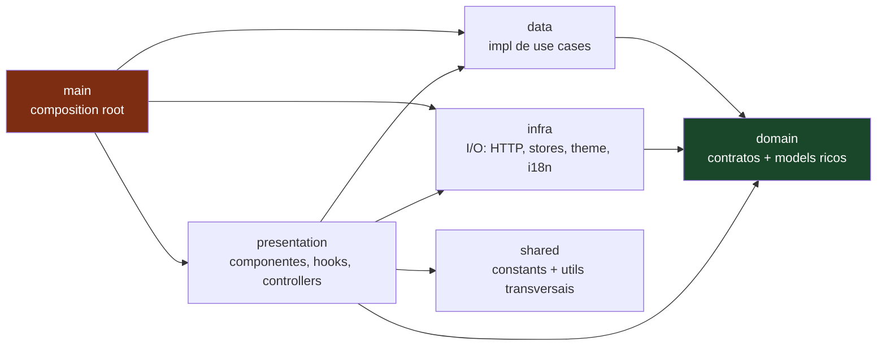

# React Clean Architecture — standards Numen DS

Documento canônico do padrão **Clean Architecture aplicado a projetos React/Frontend** na Numen DS. Esta é a referência transversal — vale para **todo** projeto React da casa, não para um único repositório. O scaffold do MCP [`mcps/react-clean-arch/`](../../../mcps/react-clean-arch/) materializa essa estrutura; este documento explica o **porquê** de cada decisão e registra onde o React diverge — intencionalmente — do template [`cap-clean-architecture`](../cap-clean-architecture/README.md).

## Para quem é este documento

| Público | Como consumir |
|---------|---------------|
| **Agente de IA** (Cursor, Claude Code, Copilot) | Ponto de entrada citado em [`AGENTS.md`](../../../AGENTS.md). Leitura obrigatória antes de criar/editar arquivos em projetos React. |
| **Desenvolvedor humano** | Material de estudo para entender o paradigma; cada camada tem seu próprio README com regras, exemplos e anti-padrões. |
| **Code reviewer** | Checklist implícito — qualquer divergência com este padrão (ou com o CAP, fora das divergências registradas abaixo) é débito técnico que precisa de ADR/RFC para justificar. |

## Dependency rule (a regra mais importante)

A regra de dependência é **unidirecional** e converge para `domain/`:



| Camada | Importa de | Importada por |
|--------|-----------|---------------|
| `domain/` | **Ninguém** (só `@sweet-monads/either`) | Todas as outras |
| `data/` | `domain/` | `presentation/`, `main/` |
| `infra/` | `domain/` | `presentation/`, `main/` |
| `presentation/` | `domain/`, `data/`, `infra/`, `shared/` | `main/` |
| `shared/` | **Ninguém** (constants/utils puros) | Todas as outras |
| `main/` | Todas | **Ninguém** (entry point) |

> **Princípio orientador:** as setas só apontam para dentro (`domain/`, `shared/`). Inverter essa direção é violação de Clean Architecture e bloqueia review.

> **Divergência opcional (React vs CAP):** no React, `presentation/` **pode** importar de `infra/` — componentes usam `translate` (`@/infra/i18n`), o tema (`@/infra/theme`) e stores (`@/infra/stores`). No CAP a presentation só conhece `domain/`. Esta divergência é **opcional**: projetos que optam por dependency rule estrita (sem `presentation → infra`) rejeitam-na, injetando i18n/tema/stores via composição em `main/`. Ver [ADR-002](../../adr/002-rejeicao-divergencias-react-clean-architecture.md) para o caso do Numen Agentic Platform.

## Mapa de equivalência com o CAP

O React parte do mesmo paradigma do [`cap-clean-architecture`](../cap-clean-architecture/README.md). Onde os nomes diferem, a tabela abaixo registra a correspondência e se a divergência é intencional:

| CAP | React | Natureza da divergência |
|-----|-------|--------------------------|
| `application/` | `data/` | **Intencional** — "data layer" é a nomenclatura canônica da Clean Architecture no front (estilo Manguinho). Mesmo papel: implementação de use cases. |
| `infrastructure/` | `infra/` | **Intencional** — encurtamento adotado pela stack React; docs e generator são coerentes entre si (`src/infra/`). |
| `domain/adapters/` | `domain/protocols/` | **Intencional** — mesmo conceito (contrato técnico de dependência externa). Hoje contém `http-client.ts`. |
| `presentation/controllers` (CAP→use case) | `presentation/controllers` + `hooks` + `pages` + `components` + `layouts` | **Particularidade React** — a presentation é mais rica (UI, estado de tela, hooks). |
| `main/factories` (adapters, repositories, services, use-cases, utils, controllers) | `main/factories` (use-cases, controllers, pages) | **Particularidade React** — factories de **page** (componentes que montam controller + página); sem `factories/repositories/` (o repositório é instanciado dentro da factory do use case). |
| — | `shared/` | **Sem equivalente no CAP** — constants (`ROUTES`) e utils transversais do front. |
| `Either<AbstractError, T>` | `Either<AbstractError, T>` | Igual. |
| `AbstractError` + 6 subclasses (400/401/403/404/409/500) | Idem | Igual (o `AbstractError` React é mais simples — sem `args` de i18n). |
| Imports NodeNext com extensão `.js` | Imports sem extensão (Vite/`moduleResolution: bundler`) | **Depende de `moduleResolution`** — `bundler` = sem extensão; `NodeNext` = `.js` obrigatório (igual ao CAP). Ver [ADR-002](../../adr/002-rejeicao-divergencias-react-clean-architecture.md). |
| `abstract.ts` (arquivo base de erro) | `abstract.ts` | Igual (alinhado nesta revisão). |
| Factory de model `static with(props)` / `withFrom*` | Idem (`with`, `withFromResponse`, `withFromResponseList`) | Igual. |
| Sem barrels (exceto `errors/index.ts`) | Barrels permitidos em `components/index.ts`, `controllers/base/index.ts`, `pages/index.ts` | **Particularidade React** — re-export idiomático de componentes/controllers. |

## As 6 camadas — visão de uma página

| Camada | O que vive aqui | README |
|--------|-----------------|--------|
| **`domain/`** | Contratos (`interface XxxRepository`, `XxxUseCase`, `HttpClient`), models ricos (`class XxxModel`), erros (`AbstractError` + subclasses HTTP) | [domain-layer/README.md](./domain-layer/README.md) |
| **`data/`** | Implementação de use cases (`XxxUseCase` → `Either`), tratamento de erro preservando `AbstractError` | [data-layer/README.md](./data-layer/README.md) |
| **`infra/`** | I/O concreto: `FetchHttpClient`, repositórios, stores Zustand, theme provider, i18n | [infra-layer/README.md](./infra-layer/README.md) |
| **`presentation/`** | Componentes, hooks, controllers, pages e layouts | [presentation-layer/README.md](./presentation-layer/README.md) |
| **`main/`** | Composition root: factories (DI manual), rotas, entry point (`index.tsx`/`app.tsx`) | [main-layer/README.md](./main-layer/README.md) |
| **`shared/`** | Constants (`ROUTES`) e utils puros transversais | [shared-layer/README.md](./shared-layer/README.md) |

## Estrutura canônica do projeto-alvo

```
src/
├── domain/                    → contratos + models (zero impl, zero framework)
│   ├── errors/                → abstract.ts + 6 subclasses HTTP
│   ├── models/                → class XxxModel + XxxProps + XxxResponse
│   ├── protocols/             → interface HttpClient
│   ├── repositories/          → interface XxxRepository + namespace
│   └── use-cases/<feature>/   → interface XxxUseCase + namespace
├── data/                      → implementação de use cases
│   └── use-cases/<feature>/   → XxxUseCaseImpl → Either<AbstractError, T>
├── infra/                     → I/O concreto
│   ├── http/                  → fetch-http-client.ts (mapError → XxxError)
│   ├── repositories/          → XxxRepositoryImpl
│   ├── stores/                → stores Zustand
│   ├── theme/                 → theme-config, theme-provider, theme-utils
│   └── i18n/                  → index.ts + pt-br.json + en.json
├── presentation/              → UI
│   ├── components/            → componentes reutilizáveis (+ index.ts barrel)
│   ├── controllers/           → base/ + <feature>/
│   ├── hooks/                 → hooks por feature
│   ├── layouts/               → AppShell e afins
│   └── pages/                 → páginas por feature
├── shared/                    → transversais
│   ├── constants/             → ROUTES
│   └── utils/                 → funções puras
└── main/                      → composition root
    ├── factories/             → use-cases/, controllers/, pages/
    ├── app.tsx, routes.tsx    → composição de rotas
    └── index.tsx              → entry point (i18n + ThemeProvider + App)
```

## Glossário — conceitos-chave

| Termo | Definição operacional |
|-------|----------------------|
| **Model** | Classe rica com `XxxProps`, factory `static with(props)` (porta única) + `withFromResponse*`, getters. Vive em `domain/models/`. Sem I/O. |
| **Use case** | `interface XxxUseCase { execute(params?): Promise<Either<AbstractError, T>> }` em `domain/`; impl em `data/use-cases/`. |
| **Repository** | Contrato de I/O. `interface XxxRepository` em `domain/`; impl em `infra/repositories/` usando o `HttpClient`. |
| **Protocol** | Contrato técnico de dependência externa (`HttpClient`). Equivale ao `adapter` técnico do CAP. |
| **Controller** | Orquestra use cases e expõe estado tipado para a UI. Método canônico `handleResult`. Sem regra de negócio. |
| **Hook** | Adapta o controller para o ciclo de vida React (`useState`/`useEffect`/`useCallback`). |
| **Page factory** | Componente React que instancia `httpClient` (módulo), monta o controller com `useMemo([])` e renderiza a página. |
| **Store** | Estado global/transversal via Zustand (`create<XxxStore>`). Consumido por **selector**. |
| **`Either<L, R>`** | Tipo canônico de retorno de use case. `left(error)` falha, `right(value)` sucesso. De `@sweet-monads/either`. |
| **`AbstractError`** | Classe base de erro. 6 subclasses obrigatórias: 400/401/403/404/409/500. |

## Regras de ouro globais (transversais às 6 camadas)

1. **Dependency rule é absoluta.** Setas só apontam para `domain/` e `shared/`. (Divergência opcional: `presentation → infra` — ver nota acima e [ADR-002](../../adr/002-rejeicao-divergencias-react-clean-architecture.md).)
2. **`Either<AbstractError, T>` é o contrato de retorno de use case.** A data layer produz `left()`/`right()`; a infra **não** retorna `Either` — propaga exceção (`throw`).
3. **O catch da data layer preserva o tipo do erro:** `if (error instanceof AbstractError) return left(error);` antes do fallback `ServerError`. Nunca rebaixar um `ConflictError`/`NotFoundError` para `ServerError`.
4. **Models ricos, nunca anêmicos.** `with(props)` é a porta única de construção; `withFromResponse`/`withFromResponseList` normalizam a API e delegam para `with()`. `from()`/`fromList()` são proibidos.
5. **DI manual via constructor `private readonly` tipado pela interface** — nunca pela impl. Toda composição vive em `main/factories/`.
6. **`public`/`private`/`protected` explícito** em todos os métodos e propriedades de classe (construtor sem modificador).
7. **Named exports apenas — `export default` proibido** (exceto arquivos de config que exigem: `vite.config.ts`, `eslint.config.mjs`).
8. **Sem framework no domain.** `react`, `@mui/material`, `zustand`, `react-router-dom`, `i18next` são proibidos em `src/domain/`. Única dependência externa: `@sweet-monads/either`.
9. **Imports via alias `@/`** — relativos (`./`, `../`) proibidos (exceção: barrels `index.ts`). Extensão `.js`: obrigatória com `moduleResolution: NodeNext` (igual ao CAP); omitida com `bundler` (Vite padrão). Ver [ADR-002](../../adr/002-rejeicao-divergencias-react-clean-architecture.md).
10. **Code-style é o do monorepo:** 4 espaços, single quotes, `;` sempre, `trailingComma: none`, `arrowParens: always`, `curly: all`, `import/order` alfabético. Prettier/ESLint herdados de `cap-clean-arch` são a fonte de verdade.
11. **Todo valor dinâmico interpolado em URL** (ex.: `id` de `useParams`) passa por `encodeURIComponent`.
12. **Stores consumidos por selector** (`useStore((s) => s.x)`) — nunca desestruturando o store inteiro.
13. **Nenhum arquivo `.tsx` acima de 250 linhas** (acima de 350 é defeito). Componente de folha não consome contexto — recebe rótulos por props, e tem teste obrigatório. Ver [presentation-layer/granularity.md](./presentation-layer/granularity.md) e [testing.md](./presentation-layer/testing.md).

## Anti-padrões (substitutos canônicos)

| Anti-padrão | Substituto canônico |
|-------------|--------------------|
| `from()`/`fromList()` como factory de model | `with(props)` + `withFromResponse`/`withFromResponseList` |
| Catch que converte tudo em `ServerError` | `if (error instanceof AbstractError) return left(error);` primeiro |
| `BaseControllerState.error: string` | `error: AbstractError \| null` |
| `export default` em módulo de código | named export |
| Token de auth em `Bearer ${...}` sem checar existência | header só quando há token; preferir cookie `httpOnly`/memória |
| `new Intl.NumberFormat(...)` por chamada | cache de formatter por `locale:currency` |
| `useStore()` desestruturando o store inteiro | selector `useStore((s) => s.x)` |
| DTO/`interface` de request/response em repositório | tipos no namespace do contrato (`domain/`) |

## Idioma

| Contexto | Idioma |
|----------|--------|
| Código TS dos projetos React (identifiers, throws, `console.error`, comentários) | EN |
| Conteúdo gerado para o dev (README do projeto-alvo) | PT-BR |
| Esta documentação (`docs/standards/react-clean-architecture/**/*.md`) | PT-BR |

## Ordem de leitura sugerida

### Para humanos novos no padrão

1. Este README (visão geral + dependency rule + mapa de equivalência com o CAP).
2. [domain-layer/README.md](./domain-layer/README.md) — contratos e models.
3. [data-layer/README.md](./data-layer/README.md) — implementação de use cases.
4. [infra-layer/README.md](./infra-layer/README.md) — I/O concreto.
5. [presentation-layer/README.md](./presentation-layer/README.md) — UI (componentes, hooks, controllers).
6. [main-layer/README.md](./main-layer/README.md) — composição final.
7. [shared-layer/README.md](./shared-layer/README.md) — transversais.
8. [`docs/standards/code-style/typescript-syntax.md`](../code-style/typescript-syntax.md) — sintaxe TS.

### Para agentes implementando uma feature

1. Este README (regras de ouro + dependency rule).
2. README da camada onde o arquivo será criado.
3. Documento específico (ex.: `infra-layer/http.md`).
4. Decision Log da feature ativa em `docs/specs/features/<feat>/spec.md`.

## Documentos desta seção

- [**domain-layer/**](./domain-layer/README.md)
  - [models.md](./domain-layer/models.md) · [errors.md](./domain-layer/errors.md) · [protocols.md](./domain-layer/protocols.md) · [repositories.md](./domain-layer/repositories.md) · [use-cases.md](./domain-layer/use-cases.md)
- [**data-layer/**](./data-layer/README.md)
  - [use-cases.md](./data-layer/use-cases.md)
- [**infra-layer/**](./infra-layer/README.md)
  - [http.md](./infra-layer/http.md) · [repositories.md](./infra-layer/repositories.md) · [stores.md](./infra-layer/stores.md) · [theme.md](./infra-layer/theme.md) · [i18n.md](./infra-layer/i18n.md)
- [**presentation-layer/**](./presentation-layer/README.md)
  - [components.md](./presentation-layer/components.md) · [controllers.md](./presentation-layer/controllers.md) · [hooks.md](./presentation-layer/hooks.md) · [layouts.md](./presentation-layer/layouts.md) · [pages.md](./presentation-layer/pages.md) · [granularity.md](./presentation-layer/granularity.md) · [testing.md](./presentation-layer/testing.md)
- [**main-layer/**](./main-layer/README.md)
  - [routes.md](./main-layer/routes.md) · [factories/](./main-layer/factories/README.md) ([controllers](./main-layer/factories/controllers.md) · [pages](./main-layer/factories/pages.md) · [use-cases](./main-layer/factories/use-cases.md))
- [**shared-layer/**](./shared-layer/README.md)
  - [constants.md](./shared-layer/constants.md) · [utils.md](./shared-layer/utils.md)

## Pendências conhecidas (futuras PRs)

- `testing.md` para as camadas `domain/`, `data/` e `infra/` (o CAP tem `domain-layer/testing.md` e `infrastructure-layer/testing.md`). A estratégia de teste da presentation — componentes, hooks e resolvers — está documentada em [presentation-layer/testing.md](./presentation-layer/testing.md).
- Avaliar `BaseUseCaseImpl` no React para centralizar o `handleError` (hoje cada use case repete o try/catch com `instanceof AbstractError`).

## Referências cruzadas

- [`AGENTS.md`](../../../AGENTS.md) — porta de entrada do agente no monorepo
- [`cap-clean-architecture/README.md`](../cap-clean-architecture/README.md) — template canônico de referência
- [`docs/standards/code-style/typescript-syntax.md`](../code-style/typescript-syntax.md) — sintaxe TS
- [`mcps/react-clean-arch/`](../../../mcps/react-clean-arch/) — MCP que materializa este padrão

## Como contribuir com este padrão

Mudanças neste padrão **não são feitas em PR direto**. O fluxo é:

1. **Discussão aberta** → criar RFC em `docs/rfc/` (skill `create-rfc`).
2. **Decisão fechada** → registrar ADR (skill `create-adr`) no Decision Log do projeto em `docs/specs/project/STATE.md`.
3. **Implementação** → atualizar o(s) README(s) da(s) camada(s) + atualizar generators do MCP `react-clean-arch` no mesmo PR (testes vivos).
4. **Drift check** → conferir consistência entre standards, generators e specs de feature ativas.

Itens removidos do escopo **não devem ser ressuscitados** sem novo ADR.
